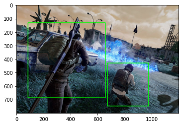
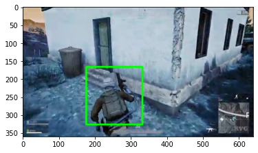
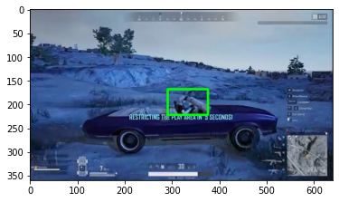

# PUBG_AIMBOT
<b>Pubg Real Time Player Detection Using TF2 </b>

 <b>Steps for training the model on google colab </b> 
 <b> follow the below link and perfrom step by step execution </b> 
"https://colab.research.google.com/drive/1tO3nGFzFX5nvARWqdr7m5bMUVM9W5NaW#scrollTo=vMNPnML5y9b7"

 <b>Steps for training the model on local machine </b> 

1) set up the tensorflow2 with cuda and gpu enabled in ur system . 
2) copy the repo from github to get the tensorflow ODM api . 
        "https://github.com/tensorflow/models"
3) convert the png's and xml's to .csv files using "xml_to_csv.py" . 
4) convert the test and train .csv files into the .record files by running "generate_tfrecord.py" file .
5) make sure u have the labelmap.pbtxt and pipeline.config files parameters according to your need .
6) train the model via following command
 <b>"!python /content/models/research/object_detection/model_main_tf2.py \
    --pipeline_config_path={pipeline_config_path} \
    --model_dir={model_dir} \
    --alsologtostderr \
    --num_train_steps={num_steps} \
    --sample_1_of_n_eval_examples=1 \
    --num_eval_steps={num_eval_steps}"</b> 
    
   make sure that u have passed the paths correctly . 
7) once the training is completed , generate the inference graph of the final checkpoint created during the model training .
   <b> "!python /content/models/research/object_detection/exporter_main_v2.py \
    --trained_checkpoint_dir {model_dir} \
    --output_directory {output_directory} \
    --pipeline_config_path {pipeline_config_path}"</b> 
    
    I have uploaded the folder here so that u can avoid the training of the model (but it's better to train it if u have better dataset than given one) .
8) Now run the "prediciton.py" file which will look for all the images present inside of the "images/test" directory and will give
    the results with the bounding boxes on it .
 
    
!!!!!!!!!!!!!!!!!!!!!!!!!!!!!!!!!!!!!!!!!!! HAPPY CODING !!!!!!!!!!!!!!!!!!!!!!!!!!!!!!!!!!!!!!!!!!!!!! 
<b>@ Author </b>  
<b>Ayush Mishra</b> 

  
  
  
